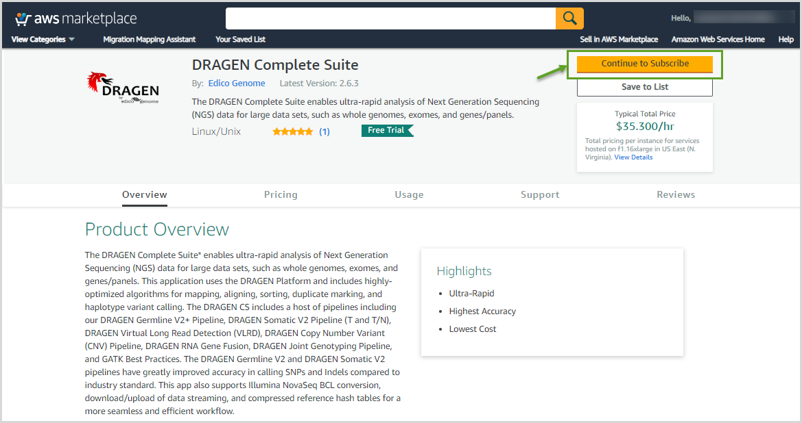
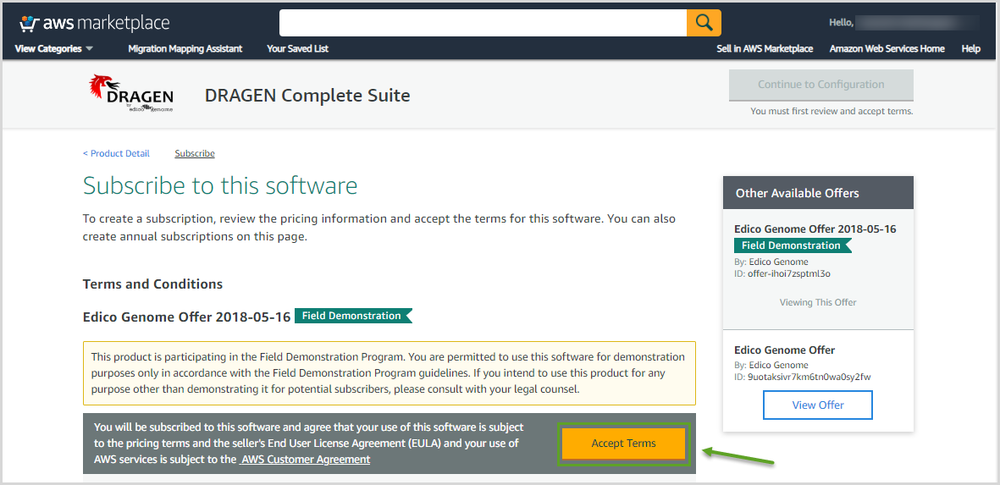
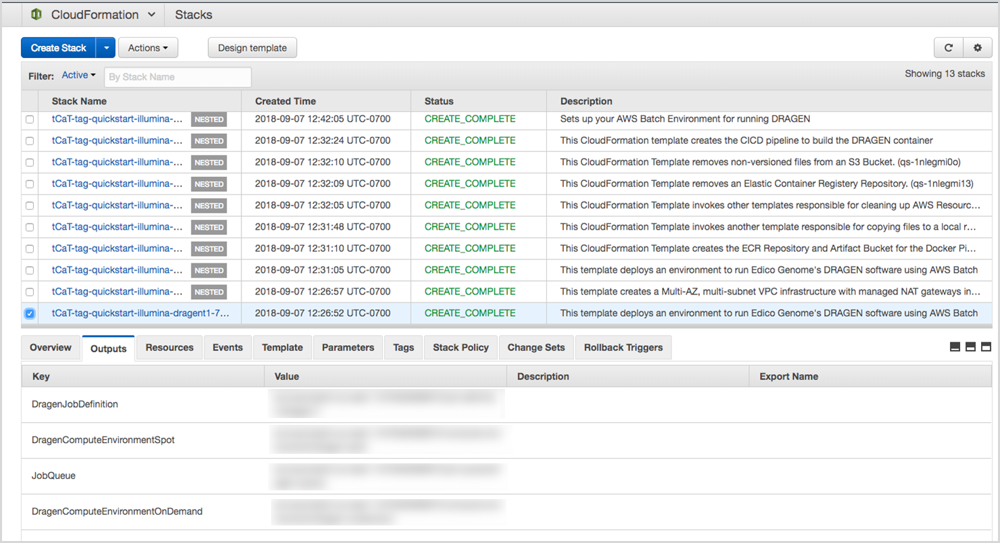

//[[deployment-steps]]
//== Deployment Steps

[[step-1.-prepare-your-aws-account]]
=== Step 1. Prepare Your AWS Account

1.  If you don’t already have an AWS account, create one at https://aws.amazon.com by following the on-screen instructions.

1.  Use the region selector in the navigation bar to choose the AWS Region where you want to deploy DRAGEN on AWS.

*Important* This Quick Start includes F1 instances, which aren’t available in all AWS Regions. For a list of supported regions, see https://docs.aws.amazon.com/general/latest/gr/rande.html#elasticfilesystem-region[the] https://aws.amazon.com/ec2/pricing/on-demand/[Amazon EC2 Pricing] webpage.

1.  Create a https://docs.aws.amazon.com/AWSEC2/latest/UserGuide/ec2-key-pairs.html[key pair] in your preferred region.
2.  If necessary, https://console.aws.amazon.com/support/home#/case/create?issueType=service-limit-increase&limitType=service-code-[request a service limit increase] for the Amazon EC2 *F1* instance type. You might need to do this if you already have an existing deployment that uses this instance type, and you think you might exceed the http://docs.aws.amazon.com/AWSEC2/latest/UserGuide/ec2-resource-limits.html[default limit] with this deployment.

[[step-2.-subscribe-to-the-dragen-ami]]
=== Step 2. Subscribe to the DRAGEN AMI

This Quick Start uses the AMI for DRAGEN Complete Suite in AWS Marketplace and requires that you accept the terms for the AMI from the AWS account where the Quick Start will be deployed.

1.  Log in to the AWS Marketplace at https://aws.amazon.com/marketplace.

1.  Open the page for https://aws.amazon.com/marketplace/pp/B07CZ3F5HY[DRAGEN Complete Suite]. Note that this will default to the latest version of DRAGEN, if your AWS account is in the trial period. At the end of the trial period, you can subscribe to an older version of DRAGEN.

[#marketplace]
.DRAGEN Complete Suite in AWS Marketplace
[link=images/image2.png]

1.  Choose *Continue to Subscribe* to view the license terms and pricing information.

1.  Choose *Accept Terms*. For detailed instructions, see the https://aws.amazon.com/marketplace/help/200799470[AWS Marketplace documentation].

[#marketplaceterms]
.Accepting software terms in AWS Marketplace
[link=images/image3.png]

Figure 3: Accepting software terms in AWS Marketplace

1.  When the subscription process is complete, exit out of AWS Marketplace without further action. *Do not* provision the software from AWS Marketplace—the Quick Start will deploy the AMI for you.

[[step-3.-launch-the-quick-start]]
=== Step 3. Launch the Quick Start

*Note* You are responsible for the cost of the AWS services used while running this Quick Start reference deployment. There is no additional cost for using this Quick Start. For full details, see the pricing pages for each AWS service you will be using in this Quick Start. Prices are subject to change.

1.  Choose one of the following options to launch the AWS CloudFormation template into your AWS account. For help choosing an option, see link:#deployment-options[deployment options] earlier in this guide.

[cols=",",]
|========================================
a|
#_Scenario_1:_Deploy_1[Option 1]

Deploy DRAGEN into a +
new VPC on AWS

 a|
#_Scenario_2:_Extending_1[Option 2]

Deploy DRAGEN into an existing VPC on AWS

|========================================

*Important* If you’re deploying DRAGEN into an existing VPC, make sure that your VPC has two private subnets in different Availability Zones for the AWS Batch compute environments. These subnets require http://docs.aws.amazon.com/AmazonVPC/latest/UserGuide/vpc-nat.html[NAT gateways or NAT instances] in their route tables, to allow the instances to download packages and software without exposing them to the internet. You will also need the domain name option configured in the DHCP options as explained in the http://docs.aws.amazon.com/AmazonVPC/latest/UserGuide/VPC_DHCP_Options.html[Amazon VPC documentation]. You will be prompted for your VPC settings when you launch the Quick Start.

Each deployment takes about 15 minutes to complete.

1.  Check the region that’s displayed in the upper-right corner of the navigation bar, and change it if necessary. This is where the network infrastructure for DRAGEN will be built. The template is launched in the US East (Virginia) Region by default.

*Important* This Quick Start includes F1 instances, which aren’t available in all AWS Regions. For a list of supported regions, see https://docs.aws.amazon.com/general/latest/gr/rande.html#elasticfilesystem-region[the] https://aws.amazon.com/ec2/pricing/on-demand/[Amazon EC2 Pricing] webpage.

1.  On the *Select Template* page, keep the default setting for the template URL, and then choose *Next*.
2.  On the *Specify Details* page, change the stack name if needed. Review the parameters for the template. Provide values for the parameters that require input. For all other parameters, review the default settings and customize them as necessary. When you finish reviewing and customizing the parameters, choose *Next*.
+
In the following tables, parameters are listed by category and described separately for the two deployment options:

* link:#sc1[Parameters for deploying DRAGEN into a new VPC]
* link:#sc2[Parameters for deploying DRAGEN into an existing VPC]

*Option 1: Parameters for deploying DRAGEN into a new VPC*

https://fwd.aws/jGP6j[View template]

_Network Configuration:_

[cols=",,",options="header",]
|===============================================================================================================================================================================================================
|Parameter label (name) |Default |Description
|Availability Zones +
(AvailabilityZones) |_Requires input_ |The list of Availability Zones to use for the subnets in the VPC. The Quick Start uses two Availability Zones from your list and preserves the logical order you specify.
|VPC CIDR +
(VPCCIDR) |10.0.0.0/16 |The CIDR block for the VPC.
|Private Subnet 1 CIDR +
(PrivateSubnet1CIDR) |10.0.0.0/19 |The CIDR block for the private subnet located in Availability Zone 1.
|Private Subnet 2 CIDR +
(PrivateSubnet2CIDR) |10.0.32.0/19 |The CIDR block for the private subnet located in Availability Zone 2.
|Public Subnet 1 CIDR +
(PublicSubnet1CIDR) |10.0.128.0/20 |The CIDR block for the public (DMZ) subnet located in Availability Zone 1.
|Public Subnet 2 CIDR +
(PublicSubnet2CIDR) |10.0.144.0/20 |The CIDR block for the public (DMZ) subnet located in Availability Zone 2.
|===============================================================================================================================================================================================================

_DRAGEN Quick Start Configuration:_

[cols=",,",options="header",]
|============================================================================================================================================================================================================================================================================================================================================================================================================
|Parameter label (name) |Default |Description
|Key Pair Name +
(KeyPairName) |_Requires input_ |A public/private key pair, which allows you to connect securely to your instance after it launches. When you created an AWS account, this is the key pair you created in your preferred region.
|Instance Type +
(InstanceType) |f1.4xlarge a|
The EC2 instance type for DRAGEN instances in the AWS Batch compute environment. This must be an instance type in the https://aws.amazon.com/ec2/instance-types/f1/[F1 instance family], because DRAGEN requires a field-programmable gate array (FPGA).

You should make sure that the F1 instance limits in your AWS account support the maximum number of simultaneous DRAGEN jobs that you expect to run, as discussed in the link:#technical-requirements[Technical Requirements] section.

|Spot Bid Percentage +
(BidPercentage) |50 a|
The bid percentage set for your AWS Batch managed compute environment with Spot Instances. Specify a value between 1 and 100.

The bid percentage specifies the maximum percentage that a Spot Instance price can be when compared with the On-Demand price for that instance type before instances are launched. For example, if you set this parameter to 20, the Spot price must be below 20% of the current On-Demand price for that EC2 instance. You always pay the lowest (market) price and never more than your maximum percentage.

|Min vCPUs +
(MinvCpus) |0 |The minimum number of virtual CPUs for your AWS Batch compute environment. You can specify a value between 0 and 1000. We recommend keeping the default value of 0.
|Max vCPUs +
(MaxvCpus) |_Requires input_ |The maximum number of virtual CPUs for your AWS Batch compute environment. You can specify a value between 16 (for f1.4xlarge) and 1000.
|Desired vCPUs +
(DesiredvCpus) |0 |The desired number of virtual CPUs for your AWS Batch compute environment. You can specify a value between 0 and 1000. We recommend that you use the same number as the *Min vCPUs* parameter to optimize costs.
|Genomics Data Bucket +
(GenomicsS3Bucket) |_Requires input_ a|
The S3 bucket to be used for reading and writing genomics data. The bucket name can include numbers, lowercase letters, uppercase letters, and hyphens, but should not start or end with a hyphen.

This must be an existing S3 bucket that contains your genomic input datasets, DRAGEN-specific reference hash tables, and an outputs folder, as explained in the link:#technical-requirements[Technical Requirements] section.

|AWS Batch Retry Number +
(RetryNumber) |1 |The number of times the AWS Batch job will be retried if it fails. You can specify a value between 1 and 10. For more information, see the https://docs.aws.amazon.com/batch/latest/userguide/job_retries.html[AWS Batch documentation].
|============================================================================================================================================================================================================================================================================================================================================================================================================

_AWS Quick Start Configuration:_

[cols=",,",options="header",]
|==================================================================================================================================================================================================================================================================================================================================================================================
|Parameter label (name) |Default |Description
|Quick Start S3 Bucket Name +
(QSS3BucketName) |aws-quickstart |The S3 bucket you have created for your copy of Quick Start assets, if you decide to customize or extend the Quick Start for your own use. The bucket name can include numbers, lowercase letters, uppercase letters, and hyphens, but should not start or end with a hyphen.
|Quick Start S3 Key Prefix +
(QSS3KeyPrefix) |quickstart-illumina-dragen/ |The https://docs.aws.amazon.com/AmazonS3/latest/dev/UsingMetadata.html[S3 key name prefix] used to simulate a folder for your copy of Quick Start assets, if you decide to customize or extend the Quick Start for your own use. This prefix can include numbers, lowercase letters, uppercase letters, hyphens, and forward slashes.
|==================================================================================================================================================================================================================================================================================================================================================================================

*Option 2: Parameters for deploying DRAGEN into an existing VPC*

https://fwd.aws/6qg6z[View template]

_Network Configuration:_

[cols=",,",options="header",]
|======================================================================================================================================
|Parameter label (name) |Default |Description
|VPC ID +
(VPCID) |_Requires input_ |The ID of your existing VPC (e.g., vpc-0343606e).
|Private Subnet 1 ID +
(PrivateSubnet1ID) |_Requires input_ |The ID of the private subnet in Availability Zone 1 in your existing VPC (e.g., subnet-a0246dcd).
|Private Subnet 2 ID +
(PrivateSubnet2ID) |_Requires input_ |The ID of the private subnet in Availability Zone 2 in your existing VPC (e.g., subnet-b58c3d67).
|======================================================================================================================================

_DRAGEN Quick Start Configuration:_

[cols=",,",options="header",]
|============================================================================================================================================================================================================================================================================================================================================================================================================
|Parameter label (name) |Default |Description
|Key Pair Name +
(KeyPairName) |_Requires input_ |A public/private key pair, which allows you to connect securely to your instance after it launches. When you created an AWS account, this is the key pair you created in your preferred region.
|Instance Type +
(InstanceType) |f1.4xlarge a|
The EC2 instance type for DRAGEN instances in the AWS Batch compute environment. This must be an instance type in the https://aws.amazon.com/ec2/instance-types/f1/[F1 instance family], because DRAGEN requires a field-programmable gate array (FPGA).

You should make sure that the F1 instance limits in your AWS account support the maximum number of simultaneous DRAGEN jobs that you expect to run, as discussed in the link:#technical-requirements[Technical Requirements] section.

|Spot Bid Percentage +
(BidPercentage) |50 a|
The bid percentage set for your AWS Batch managed compute environment with Spot Instances. Specify a value between 1 and 100.

The bid percentage specifies the maximum percentage that a Spot Instance price can be when compared with the On-Demand price for that instance type before instances are launched. For example, if you set this parameter to 20, the Spot price must be below 20% of the current On-Demand price for that EC2 instance. You always pay the lowest (market) price and never more than your maximum percentage.

|Min vCPUs +
(MinvCpus) |0 |The minimum number of virtual CPUs for your AWS Batch compute environment. You can specify a value between 0 and 1000. We recommend keeping the default value of 0.
|Max vCPUs +
(MaxvCpus) |_Requires input_ |The maximum number of virtual CPUs for your AWS Batch compute environment. You can specify a value between 0 and 1000.
|Desired vCPUs +
(DesiredvCpus) |0 |The desired number of virtual CPUs for your AWS Batch compute environment. You can specify a value between 0 and 1000. We recommend that you use the same number as the *Min vCPUs* parameter to optimize costs.
|Genomics Data Bucket +
(GenomicsS3Bucket) |_Requires input_ a|
The S3 bucket to be used for reading and writing genomics data. The bucket name can include numbers, lowercase letters, uppercase letters, and hyphens, but should not start or end with a hyphen.

This must be an existing S3 bucket that contains your genomic input datasets, DRAGEN-specific reference hash tables, and an outputs folder, as explained in the link:#technical-requirements[Technical Requirements] section.

|AWS Batch Retry Number +
(RetryNumber) |1 |The number of times the AWS Batch job will be retried if it fails. You can specify a value between 1 and 10. For more information, see the https://docs.aws.amazon.com/batch/latest/userguide/job_retries.html[AWS Batch documentation].
|============================================================================================================================================================================================================================================================================================================================================================================================================

_AWS Quick Start Configuration:_

[cols=",,",options="header",]
|==================================================================================================================================================================================================================================================================================================================================================================================
|Parameter label (name) |Default |Description
|Quick Start S3 Bucket Name +
(QSS3BucketName) |aws-quickstart |The S3 bucket you have created for your copy of Quick Start assets, if you decide to customize or extend the Quick Start for your own use. The bucket name can include numbers, lowercase letters, uppercase letters, and hyphens, but should not start or end with a hyphen.
|Quick Start S3 Key Prefix +
(QSS3KeyPrefix) |quickstart-illumina-dragen/ |The https://docs.aws.amazon.com/AmazonS3/latest/dev/UsingMetadata.html[S3 key name prefix] used to simulate a folder for your copy of Quick Start assets, if you decide to customize or extend the Quick Start for your own use. This prefix can include numbers, lowercase letters, uppercase letters, hyphens, and forward slashes.
|==================================================================================================================================================================================================================================================================================================================================================================================

1.  On the *Options* page, you can https://docs.aws.amazon.com/AWSCloudFormation/latest/UserGuide/aws-properties-resource-tags.html[specify tags] (key-value pairs) for resources in your stack and https://docs.aws.amazon.com/AWSCloudFormation/latest/UserGuide/cfn-console-add-tags.html[set advanced options]. When you’re done, choose *Next*.
2.  On the *Review* page, review and confirm the template settings. Under *Capabilities*, select the check box to acknowledge that the template will create IAM resources.
3.  Choose *Create* to deploy the stack.
4.  Monitor the status of the stack. When the status is *CREATE_COMPLETE*, the DRAGEN cluster is ready, as shown in Figure 4.
5.  Use the URLs displayed in the *Outputs* tab for the stack to view the resources that were created.

[#stack]
.Stack outputs
[link=images/image4.png]

