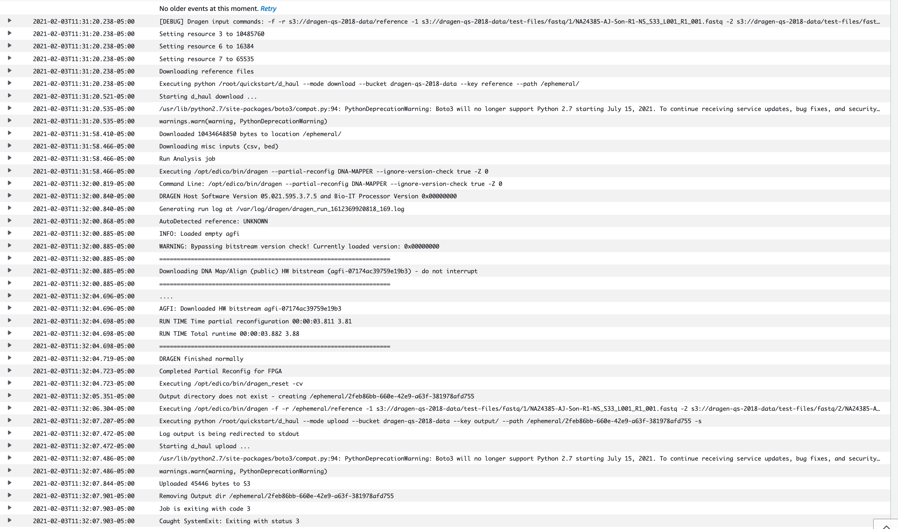
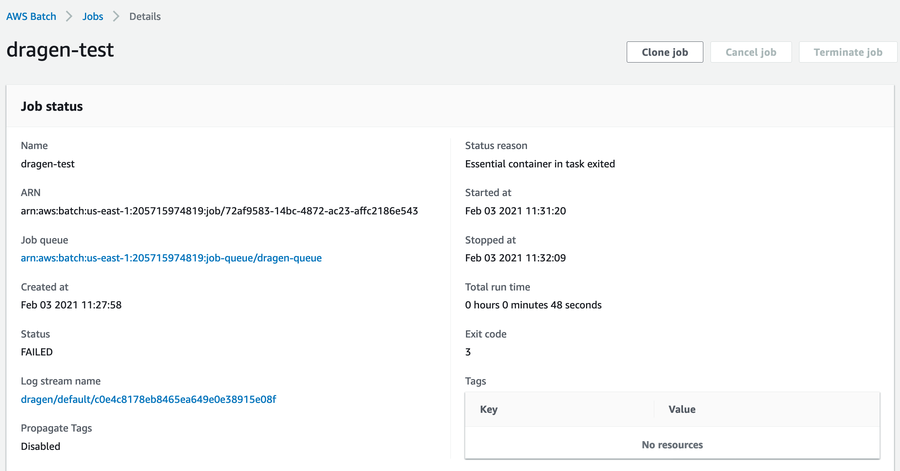

// Add any tips or answers to anticipated questions.

[[faq]]
== FAQ

*Q.* I encountered a CREATE_FAILED error when I launched the Quick Start.

*A.* If AWS CloudFormation fails to create the stack, we recommend that you relaunch the template with *Rollback on failure* set to *No*. (This setting is under *Advanced* in the AWS CloudFormation console, *Options* page.) With this setting, the stack’s state will be retained and the instance will be left running, so you can troubleshoot the issue.

*Important* When you set *Rollback on failure* to *No*, you will continue to incur AWS charges for this stack. Please make sure to delete the stack when you finish troubleshooting.

For additional information, see https://docs.aws.amazon.com/AWSCloudFormation/latest/UserGuide/troubleshooting.html[Troubleshooting AWS CloudFormation^] on the AWS website.

*Q.* I encountered a size limitation error when I deployed the AWS CloudFormation templates.

*A.* We recommend that you launch the Quick Start templates from the links in this guide or from another S3 bucket. If you deploy the templates from a local copy on your computer or from a non-S3 location, you might encounter template size limitations when you create the stack. For more information about AWS CloudFormation limits, see the http://docs.aws.amazon.com/AWSCloudFormation/latest/UserGuide/cloudformation-limits.html[AWS documentation^].

*Q.* How can I find out whether my {partner-product-short-name} job has completed?

*A.* When you submit a {partner-product-short-name} job by using the AWS CLI or the AWS Batch console, as described previously in link:#_test_the_deployment[Test the deployment] section, you will get an AWS Batch job ID. You should monitor the job status to check for completion. When the job has completed successfully, its job state will be displayed as SUCCEEDED and the outputs will be uploaded into the output S3 bucket location that is specified in the job. For more information about job states, see the https://docs.aws.amazon.com/batch/latest/userguide/job_states.html[AWS Batch documentation^].

*Q.* What should I do if the {partner-product-short-name} job fails?

*A.* If your {partner-product-short-name} job fails, more information will be available in Amazon CloudWatch Logs. You can access the log either from the CloudWatch console (see <<logCW>>) or through the *Log stream name* link in the AWS Batch job (see <<logBatch>>).

//In these examples, the user didn’t specify an S3 bucket for the *Genomics Data Bucket* parameter when they deployed the Quick Start, which caused the error:

//20:36:03. Error: Output S3 location not specified!

:xrefstyle: short
[#logCW]
.Accessing logs from the CloudWatch console
[link=images/image6.png]

:xrefstyle: short
[#logBatch]
.Accessing logs from the AWS Batch console
[link=images/image7.png]

When you run a {partner-product-short-name} job, you use the `--output-directory` parameter to specify an S3 output bucket, as described in link:#_test_the_deployment[Test the deployment] section. If the {partner-product-short-name} job fails, more information about the failure is provided in the {partner-product-short-name} process output log, which is uploaded to the S3 bucket you specified. Look for the object in the S3 bucket that has the key name `dragen_log__<timestamp>.txt` for the output log.

Generally, {partner-product-short-name} process logs will give adequate information about failures, but if you need further help, please contact {partner-company-name} at techsupport@illumina.com.

[[additional-resources]]
== Additional Resources

*AWS services*

* Amazon EC2 +
https://aws.amazon.com/documentation/ec2/
* Amazon VPC +
https://aws.amazon.com/documentation/vpc/
* AWS CloudFormation +
https://aws.amazon.com/documentation/cloudformation/

*{partner-product-short-name} documentation*

* {partner-product-name} Bio-IT Platform Support Resources +
https://sapac.support.illumina.com/sequencing/sequencing_software/dragen-bio-it-platform.html
* Performance studies
  - https://precision.fda.gov/challenges/1/view/results[PrecisionFDA Hidden Treasures – Warm Up^]
  - https://blog.dnanexus.com/2018-03-08-how-to-train-your-dragen-evaluating-and-improving-edico-genomes-rapid-wgs-tools/[How to Train Your {partner-product-short-name} – Evaluating and Improving Edico Genome's Rapid WGS Tools^]

*Public genomic data*

* Reference hash table for {partner-product-short-name} v3.7.5 +
https://ilmn-dragen-giab-samples.s3.amazonaws.com/Hashtable/hg19-cnv-anchored.v8.tar
* Small data samples for testing
  - https://ilmn-dragen-giab-samples.s3.amazonaws.com/WES/HG002/NA24385-AJ-Son-R1-NS_S33_L001_R1_001.fastq.gz
  - https://ilmn-dragen-giab-samples.s3.amazonaws.com/WES/HG002/NA24385-AJ-Son-R1-NS_S33_L001_R2_001.fastq.gz
